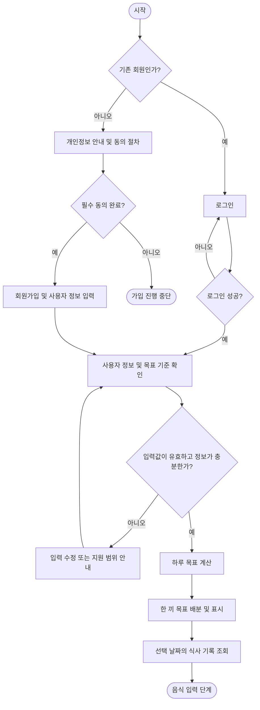
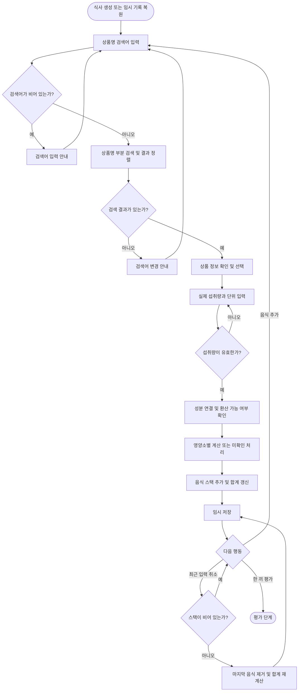
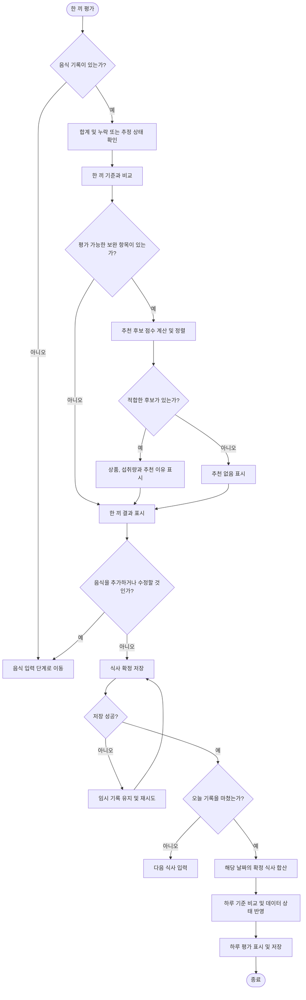

# 결식아동을 위한 편의점 식품 선택과 영양 평가 로직 설계

## 1. 프로젝트 개요

국가표준식품성분 데이터베이스를 활용하여, 편의점에서 식사를 선택하는 결식아동이 영양정보를 이해하고 영양 구성을 고려해 식품을 선택하도록 돕는 4인 팀 프로젝트다.

사용자가 상품명 검색으로 식품을 선택하고 실제 먹은 양을 기록하면, 한 끼 영양 구성을 확인하고 보완 식품을 추천받을 수 있도록 설계한다. 하루 식사 기록을 합산한 종합 평가도 제공한다.

이 문서는 로직 설계 결과물이며, 기능 구현 완료를 의미하지 않는다.

## 2. 설계 범위

- 회원가입, 개인정보 동의와 사용자 정보 입력
- 하루 및 한 끼 목표 설정
- 상품명 검색을 통한 식품 선택
- 실제 섭취량에 따른 영양소 계산
- 스택을 활용한 음식 추가와 최근 입력 취소
- 한 끼와 하루 영양소 합산 및 목표 비교
- 보완 식품 추천
- 식사 기록 저장 및 하루 종합 평가
- 입력, 조회, 계산과 저장 과정의 예외 처리

CU 상품 목록의 엑셀 정리는 별도 기여이며, 이 문서는 해당 자료를 활용하는 서비스 흐름을 다룬다.

## 3. 데이터 사용 원칙

| 데이터 | 역할 |
|---|---|
| CU 상품 목록 | 상품명 검색 및 상품 선택 |
| 국가표준식품성분 데이터베이스 | 연결된 식품의 성분값 조회 |
| 상품–성분 연결 정보 | CU 상품과 성분 데이터의 대응 관계 관리 |
| 사용자 정보 및 목표 기준 | 하루와 한 끼 목표 설정 |
| 식사 기록 | 상품, 섭취량, 시간, 성분값 및 출처 저장 |

### 3.1 상품과 성분 데이터 연결

CU 상품 목록에는 영양성분 수치가 포함되어 있지 않으므로, 상품과 성분 데이터를 연결하는 기준이 필요하다.

- 각 상품은 내부 상품 식별자로 구분한다.
- 상품명 검색은 사용자가 상품을 찾는 용도로 사용한다.
- 상품명이 비슷하다는 이유만으로 동일한 성분값을 가진다고 판단하지 않는다.
- 유사 식품으로 보완한 값은 추정치로 구분한다.
- 연결할 수 없거나 성분값이 없는 항목은 미확인으로 기록한다.
- 성분값의 출처, 기준 식품량, 단위 및 추정 여부를 함께 관리한다.

### 3.2 성분값 구분

| 구분 | 처리 |
|---|---|
| 확인값 | 섭취량에 맞게 환산하여 계산 |
| 추정값 | 환산하여 사용하되 추정 기반임을 표시 |
| 미확인값 | 0으로 대체하지 않고 누락 상태 유지 |

## 4. 전체 흐름

회원가입과 사용자 정보 입력
→ 하루와 한 끼 목표 설정
→ 상품명 검색 및 상품 선택
→ 실제 섭취량 입력
→ 영양소 계산 및 음식 기록 누적
→ 한 끼 평가
→ 보완 식품 추천
→ 식사 확정 저장
→ 하루 기록 합산 및 종합 평가

## 5. 회원가입 및 목표 설정

### 5.1 처리 순서

1. 기존 회원은 로그인한다.
2. 신규 회원은 개인정보 수집과 이용 안내를 확인한다.
3. 필요한 동의 절차를 거친 후 회원가입과 사용자 정보 입력을 진행한다.
4. 입력값의 누락, 형식 및 지원 범위를 검사한다.
5. 선정한 기준에 따라 하루 목표를 계산한다.
6. 계획한 식사 횟수와 배분 방식에 따라 한 끼 목표를 설정한다.
7. 목표와 적용 기준을 표시한다.
8. 선택 날짜의 기존 식사 기록을 불러온다.

### 5.2 목표 설정 원칙

- 목표 산정 공식과 필요한 사용자 정보는 별도로 확정한다.
- 성별, 키, 몸무게와 나이 등의 정보만으로 모든 목표를 계산할 수 있다고 가정하지 않는다.
- 아동의 연령에 맞는 영양 평가 기준을 검토한다.
- 성인용 기준을 아동에게 그대로 적용하지 않는다.
- 영양소별 목표량, 목표 범위, 상한 기준을 구분한다.
- 모든 영양소를 무조건 추가 섭취해야 하는 대상으로 취급하지 않는다.
- 한 끼 목표는 하루 목표에서 배분하며, 식사 횟수가 늘었다는 이유만으로 하루 목표를 늘리지 않는다.
- 개인정보 수집 범위와 필요한 동의 및 보호 절차는 별도 검토한다.



## 6. 상품 검색 및 선택

### 6.1 상품명 검색

CU 상품 목록을 길게 스크롤하지 않고 원하는 식품을 찾을 수 있도록, 선택창에 상품명 검색 기능을 제공한다.

1. 사용자가 검색어를 입력한다.
2. 검색어와 검색 대상 상품명의 공백과 영문 대소문자를 일관된 방식으로 정리한다.
3. 상품명에 검색어가 포함되는 후보를 조회한다.
4. 다음 순서로 결과를 정렬한다.
   - 상품명 완전 일치
   - 검색어로 시작
   - 검색어 포함
5. 결과가 많으면 일정 개수씩 나누어 표시한다.
6. 사용자가 상품 정보를 확인하고 선택한다.
7. 선택한 상품의 내부 식별자로 성분 연결 정보를 조회한다.

예를 들어 ‘김밥’을 입력하면 상품명에 ‘김밥’이 포함된 상품을 표시한다.

같은 이름의 상품은 용량 등 확인 가능한 구분 정보를 함께 표시한다. 검색 결과의 첫 번째 상품을 자동으로 섭취 기록에 추가하지 않는다.

### 6.2 검색 예외

- 빈 검색어: 검색어 입력 안내
- 결과 없음: 검색어 변경 안내
- 조회 실패: 입력을 유지하고 재시도 안내
- 동일 이름의 상품 여러 개: 구분 정보를 표시하여 사용자 선택
- 상품 구분 정보 부족: 임의 선택하지 않고 확인 불가 안내

## 7. 섭취량 입력 및 영양소 계산

### 7.1 입력값

- 선택한 상품
- 실제 먹은 양
- 섭취량 단위
- 먹은 날짜와 시간

### 7.2 계산식

섭취량과 성분 데이터의 기준량을 같은 단위로 환산할 수 있을 때 다음 식을 적용한다.

섭취 영양소량 = 기준 성분값 × 실제 섭취량 ÷ 기준 식품량

- 100g 기준 데이터: 실제 먹은 무게에 비례하여 계산
- 한 포장 기준 데이터: 실제 먹은 포장 비율에 따라 계산
- g과 mL 등 서로 다른 단위: 근거 없이 환산하지 않음
- 기준량이 0이거나 단위가 불명확한 경우: 계산하지 않고 미확인 처리

### 7.3 반복 계산

```text
for 각 영양소:
    if 성분값이 없거나 단위 환산이 불가능:
        해당 성분을 미확인으로 기록
    else:
        섭취 영양소량 계산
        성분값의 출처와 추정 여부 기록
```

칼로리와 단백질, 탄수화물 등 각 영양소는 별도로 계산한다. 칼로리 합계만으로 다른 영양소의 양을 추론하지 않는다.

## 8. 스택을 활용한 음식 기록

### 8.1 스택 저장 단위

음식 하나를 다음 정보의 묶음으로 저장한다.

- 음식 기록 식별자
- 상품 식별정보
- 실제 섭취량과 단위
- 영양소별 계산값
- 미확인 또는 추정 상태
- 성분 출처
- 섭취 날짜와 시간

### 8.2 음식 추가

1. 상품과 섭취량을 검증한다.
2. 영양소별 섭취량을 계산한다.
3. 음식 묶음을 스택에 추가한다.
4. 한 끼 합계를 갱신한다.
5. 임시 저장한다.

### 8.3 최근 입력 취소

1. 스택이 비어 있는지 확인한다.
2. 비어 있지 않으면 마지막 음식 기록을 제거한다.
3. 남은 음식으로 합계와 미확인 상태를 다시 계산한다.
4. 임시 저장한다.

### 8.4 스택의 역할

스택은 마지막에 추가한 음식을 먼저 취소하는 기능에 사용한다.

임의의 과거 기록 수정과 삭제는 해당 음식 기록을 찾아 처리하고, 합계를 재계산한다. 스택 자체를 영구 저장소로 사용하지 않는다.



## 9. 한 끼 영양 평가

### 9.1 처리 순서

1. 음식 기록이 있는지 확인한다.
2. 기록된 음식으로 영양소별 합계를 재계산한다.
3. 영양소별 누락 및 추정 여부를 확인한다.
4. 평가 가능한 영양소를 한 끼 기준과 비교한다.
5. 섭취량, 목표 대비 상태 및 평가 제한을 표시한다.

### 9.2 비교 방식

- 목표량이 있는 경우: 목표 대비 섭취량과 남은 양 계산
- 목표 범위가 있는 경우: 범위 미만, 범위 내와 범위 초과 구분
- 상한 기준이 있는 경우: 초과 여부 확인
- 해당 기준이 없는 경우: 섭취량만 표시

목표 대비 남은 양 = max(목표량 - 섭취량, 0)

이 계산은 목표량이 정해진 영양소에만 적용한다.

### 9.3 누락 및 추정 처리

- 미확인 성분이 포함되면 확인된 양만 표시한다.
- 누락된 값을 0으로 가정하여 미달이나 적정을 확정하지 않는다.
- 추정값이 포함되면 추정 기반 결과임을 표시한다.
- 결과는 기록된 섭취량과 설정 기준의 비교이며, 신체의 영양 결핍 진단으로 표현하지 않는다.

## 10. 보완 식품 추천

### 10.1 후보 선정

1. 평가 가능한 영양소 중 보완할 항목을 확인한다.
2. CU 상품 목록에서 추천 후보를 조회한다.
3. 후보의 제안 섭취량을 기준으로 성분값을 계산한다.
4. 추천 점수에 필요한 성분이 미확인인 후보는 자동 점수 추천에서 제외한다.
5. 유사 식품 추정값을 사용한 후보는 추정 기반임을 표시한다.

### 10.2 점수 산정 방향

추천 점수 = 보완 효과의 가중합 - 목표 범위와 상한 초과에 대한 감점

- 서로 다른 영양소의 g와 mg 값을 그대로 더하지 않는다.
- 영양소별 기준 대비 비율로 비교한다.
- 남은 목표량을 넘겨 제공하는 부분에는 추가 보완 점수를 주지 않는다.
- 추천 식품을 추가했을 때 발생하는 초과 정도를 반영한다.
- 구체적인 가중치, 추천 개수 및 제안 섭취량은 별도로 확정한다.

### 10.3 결과 표시

- 추천 상품
- 제안 섭취량
- 보완하는 영양소
- 추천 이유
- 추정값 사용 여부

적합한 후보가 없으면 추천 없음과 이유를 표시한다.

추천 식품을 조회하거나 선택한 것만으로 섭취 기록을 추가하지 않는다. 실제 먹은 양을 입력해야 기록에 반영한다.

상품 목록에 등재되어 있다는 사실을 현재 매장 재고가 있다는 의미로 표시하지 않는다.

## 11. 식사 저장 및 하루 종합 평가

### 11.1 식사 확정 저장

1. 한 끼 기록을 확인한다.
2. 식사 식별자를 기준으로 저장한다.
3. 저장 성공 여부를 확인한다.
4. 실패하면 임시 기록을 유지하고 재시도를 제공한다.
5. 같은 저장 요청이 반복되어도 식사가 중복 생성되지 않게 한다.

### 11.2 하루 평가

1. 사용자가 기록 완료를 선택한다.
2. 해당 날짜에 확정 저장된 식사를 조회한다.
3. 영양소별 하루 총량을 계산한다.
4. 하루 기준과 비교한다.
5. 누락 또는 추정 상태와 기록 범위를 반영하여 결과를 표시한다.

하루 평가는 한 끼 평가 점수의 평균이 아니라, 하루 영양소 총량을 하루 기준과 비교하여 계산한다.

### 11.3 날짜 및 수정 처리

- 저장 시점이 아닌 먹은 날짜와 시간을 기준으로 식사를 구분한다.
- 자정을 지나 입력하는 식사도 섭취 날짜를 확인한다.
- 과거 식사 입력을 지원할 경우 해당 날짜의 평가를 갱신한다.
- 식사 추가, 수정 또는 삭제 후 해당 날짜의 합계를 재계산한다.
- 기록한 식사 수가 계획과 다르더라도 완료할 수 있게 한다.
- 일부 식사가 미기록되었다면 기록된 식사 기준 결과임을 표시한다.



## 12. 예외 처리

| 상황 | 처리 |
|---|---|
| 필수 동의 미완료 | 개인정보 기반 가입 진행 중단 |
| 사용자 정보 누락 또는 형식 오류 | 해당 항목 수정 안내 |
| 목표 기준의 지원 범위 밖 | 임의 목표를 만들지 않고 안내 |
| 빈 검색어 | 검색어 입력 안내 |
| 검색 결과 없음 | 검색어 변경 안내 |
| 동일 상품명 여러 개 | 용량 등 구분 정보 제공 |
| 상품 구분 정보 부족 | 임의 선택하지 않고 확인 불가 안내 |
| 상품–성분 연결 불명확 | 임의 확정하지 않고 미확인 처리 |
| 영양소 일부 누락 | 해당 성분을 미확인으로 기록 |
| 추정 성분 사용 | 계산, 평가와 추천에 추정 표시 |
| 섭취량 0, 음수 또는 숫자 아님 | 입력 수정 전 추가 차단 |
| 기준량 0 또는 환산 근거 없음 | 해당 성분 계산 중단 |
| 빈 스택에서 취소 | 기록 변경 없이 유지 |
| 빈 식사 평가 | 음식 입력 안내 |
| 같은 상품을 다시 섭취 | 별도 섭취 기록 허용 |
| 연속 클릭 또는 요청 재전송 | 같은 요청의 중복 반영 방지 |
| 조회 또는 저장 실패 | 입력 유지 및 재시도 제공 |
| 앱 종료 | 저장된 임시 기록 복원 |
| 저장된 식사 수정 또는 삭제 | 식별자로 변경 후 합계 재계산 |
| 날짜 변경 | 실제 섭취 날짜로 분리 |
| 하루 평가 후 식사 추가 | 해당 날짜 평가 갱신 |
| 추천 후보 없음 | 추천 없음과 이유 표시 |
| 일부 식사 미기록 | 기록 범위 명시 |
| 목표 또는 성분 기준 변경 | 기존 기록의 적용 기준 보존 및 재계산 여부 명시 |

## 13. 자료구조 및 알고리즘 역할

| 기능 | 방식 | 목적 |
|---|---|---|
| 상품명 검색 | 부분 일치 및 정렬 | 원하는 상품을 빠르게 선택 |
| 상품–성분 연결 조회 | 내부 상품 식별자 기반 조회 | 선택 상품의 연결 정보 확인 |
| 섭취량 환산 | 영양소별 반복 계산 | 실제 먹은 양 반영 |
| 음식 입력과 최근 취소 | 스택 | 마지막 기록부터 취소 |
| 한 끼와 하루 합산 | 누적 및 재계산 | 영양소별 총량 산출 |
| 목표 비교 | 조건 분기 | 기준 대비 상태 구분 |
| 식품 추천 | 후보별 점수 계산 및 정렬 | 보완 가능한 후보 제시 |
| 중복 저장 방지 | 기록 식별자와 요청 중복 검사 | 중복 반영 방지 |

## 14. 별도 검토 및 확정 과제

- 아동 연령에 적합한 영양 평가 기준과 적용 대상
- 목표 계산에 필요한 최소 사용자 정보
- 개인정보 수집, 보관과 동의 절차
- 하루 목표와 한 끼 배분 방식
- 평가 대상 영양소와 단위
- CU 상품과 성분 데이터의 연결과 검토 방식
- 추정 성분의 평가와 추천 적용 범위
- 추천 가중치, 후보 섭취량 및 표시 개수

영양 개선 효과는 검증된 성과로 제시하지 않는다.
아동급식카드 연동, 예산별 추천 및 매장 재고 확인은 이 설계의 확인된 기능에 포함하지 않는다.
